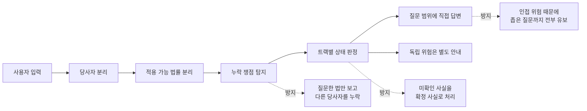
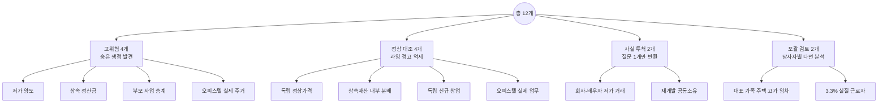
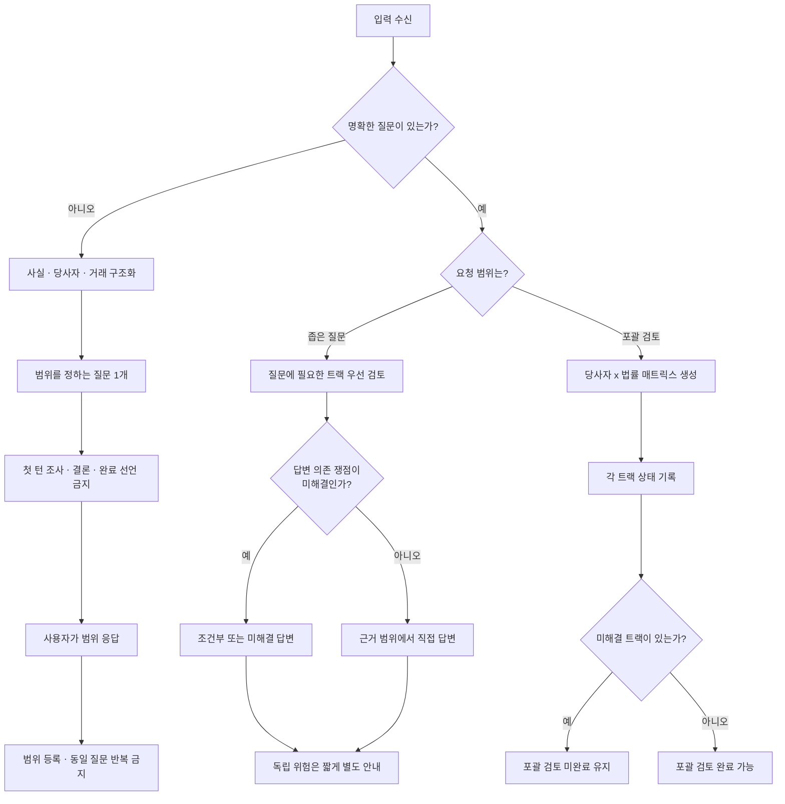
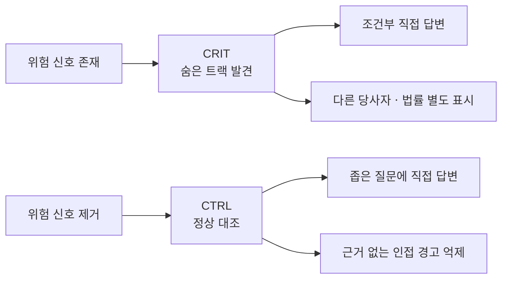
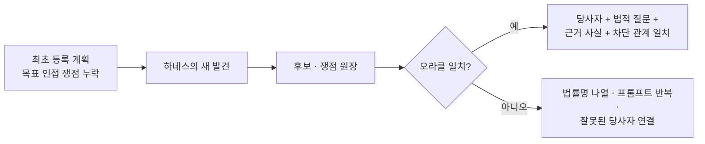
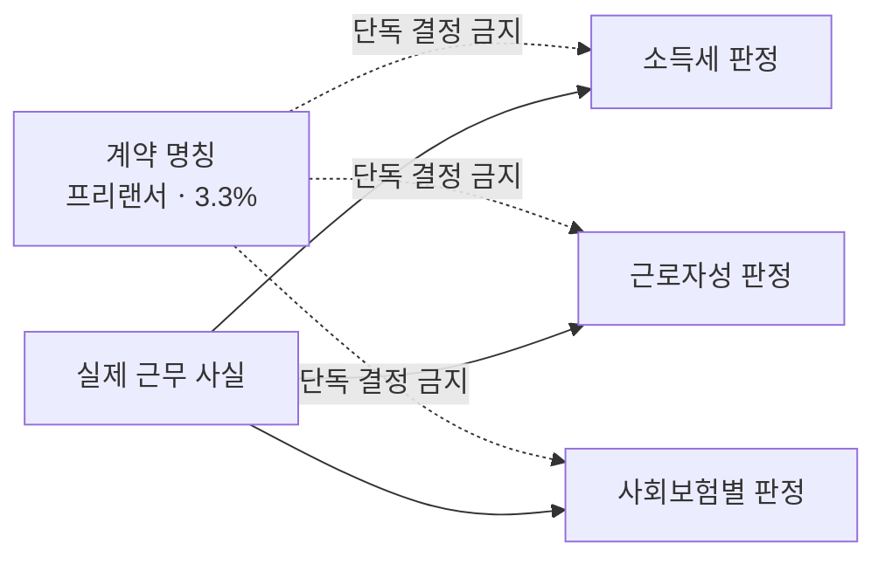
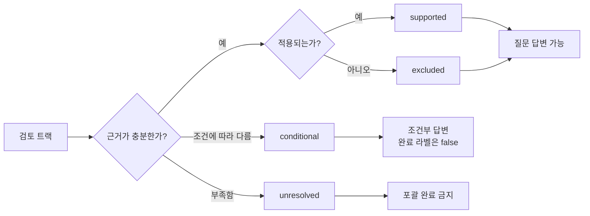
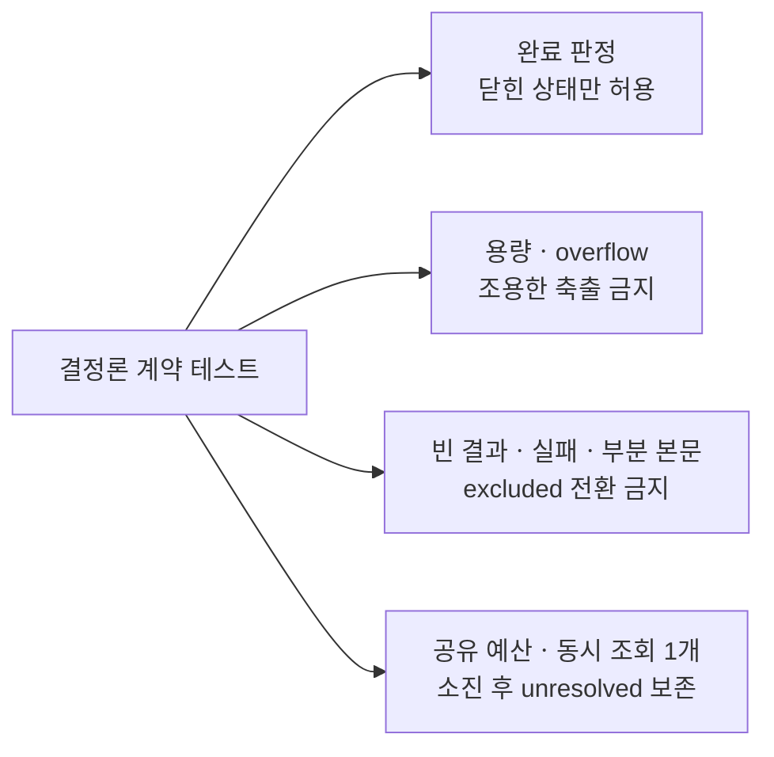
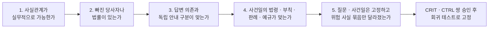

# 누락 쟁점 탐지 하네스 검수 사례 12선: 시각 요약

상태: `DRAFT - HUMAN LEGAL ORACLE NOT APPROVED`

상세 사실관계와 법령 확인 기록은 [원문 초안](./OMISSION_SCREENING_CASES_DRAFT_2026-09-22.md)을 기준으로 한다. 이 문서는 검수 구조와 사례 간 차이를 빠르게 파악하기 위한 요약본이다.

## 1. 이 하네스가 확인하는 것

핵심은 **많이 경고하는 것**이 아니라, 결론을 바꿀 쟁점은 빠뜨리지 않으면서 정상 사건에는 직접 답하는 것이다.

## 2. 12개 사례의 역할

| 묶음 | 검수 질문 | 성공 모습 | 대표 실패 |
| --- | --- | --- | --- |
| `CRIT 4` | 질문 밖의 중요 당사자ㆍ법률을 찾는가? | 직접 답변과 누락 위험을 함께 표시 | 질문한 세법만 답함 |
| `CTRL 4` | 위험 신호가 사라졌을 때 경고도 줄어드는가? | 정상 사실에는 좁고 직접적으로 답함 | CRIT 경고를 그대로 복사 |
| `FACT 2` | 질문 없는 사실만 받았을 때 멈추는가? | 구조화 후 의미상 범위 질문 1개 | 바로 조사하거나 결론을 냄 |
| `FULL 2` | 여러 당사자와 법률을 끝까지 분리하는가? | 트랙마다 상태를 남기고 미해결을 보존 | 세무 결론 하나로 전부 확정 |

## 3. 입력에 따른 답변 흐름

## 4. 고위험과 정상 대조의 차이

각 대조 사례는 고위험 사례와 **질문ㆍ사건일ㆍ비위험 사실을 고정**하고, 결론을 바꾸는 위험 사실 묶음을 제거한 것이다. 단일 변수 실험으로 과장하지 않는다.

| 쌍 | 고위험 신호 | 정상 대조 신호 | 하네스가 바꿔야 할 행동 |
| --- | --- | --- | --- |
| `01` 법인 자산 양도 | 지배주주, 6억원 거래, 정상가격 절차 없음 | 비특수관계인, 공개경쟁, 거래가ㆍ감정가 10억원 | 같은 부당행위계산부인 질문에 답하면서 위험 사건에서만 주주 증여세ㆍ상법 후보를 발견 |
| `02` 상속 협의분할 | 총재산 18억원 중 A가 상가를 단독 취득하고 고유 대출금 3억원 지급 | 각 9억원을 상속재산 내부에서 취득, 고유자금 없음 | 같은 양도소득세 질문에서 유상 이전 가능성을 보되 존재하지 않는 지급을 발명하지 않음 |
| `03` 청년창업 | 부모의 장소ㆍ장비ㆍ거래처 승계, 부모가 의사결정 | 장소ㆍ자산ㆍ계좌가 독립되고 본인이 경영 | 같은 감면 가능 질문에서 실질 승계를 위험 사건에서만 차단 후보로 생성 |
| `04` 오피스텔 | 공부상 업무시설이지만 가족이 실제 거주 | 같은 기간 동안 계약ㆍ사용ㆍ시설 모두 실제 업무용 | 같은 1세대1주택 질문에서 실제 사용 증거에 따라 행동을 바꿈 |

### 숨은 오라클과 통과 증거

기대 라벨은 모델 입력에 넣지 않는다. `CRIT-01`의 상법 후보처럼 직접 답변을 막지 않는 쟁점도 **발견은 필수, 차단은 금지**로 따로 점수화한다.

## 5. 사례별 한눈 요약

| ID | 핵심 충돌 | 반드시 분리할 것 | 기대 출력 |
| --- | --- | --- | --- |
| `CRIT-01` | 법인 자산 저가 양도 | 법인세 / 주주 증여세 / 상법 승인 | 법인세 조건부 답변 + Bㆍ상법 트랙 안내 |
| `CRIT-02` | 상속 소급효와 고유자금 정산 | 민법 / 양도ㆍ상속ㆍ증여ㆍ취득세 | 민법만으로 비과세 단정 금지 |
| `CRIT-03` | 명의상 창업과 실질 승계 | 자녀 / 부모 / 창업감면 / 실질귀속 | 대표 명의와 실제 사업자 분리 |
| `CRIT-04` | 공부상 용도와 실제 주거 | 소득세법 / 주택법 / 건축법 | 세법상 주택을 독립 판정 |
| `CTRL-01` | 독립된 정상가격 거래 | 확인된 거래 절차와 가격 | 직접 답변, 증여ㆍ상법 자동 경고 금지 |
| `CTRL-02` | 총 18억원 상속재산 내부 분배 | 각 9억원 / 지분 / 고유자금 없음 | 없는 유상 정산을 가정하지 않음 |
| `CTRL-03` | 독립적인 신규 창업 | 업종 / 지역 / 신청 / 최초 소득연도 | 승계 경고 없이 남은 요건만 제시 |
| `CTRL-04` | 실제 업무용 오피스텔 | 사용 증거 / 양도일 시행법 | 증거 범위에서 좁게 답변 |
| `FACT-01` | 회사와 대표 배우자 거래 | 법인 측 / 배우자 측 / 회사법 | 의미상 범위 질문 1개, 답변 후 반복 금지 |
| `FACT-02` | 공동소유와 불균등 분담금 | 소유자별 원가 / 세목별 범위 | 의미상 범위 질문 1개, 좁은 답변 반영 |
| `FULL-01` | 회사가 가족 주택을 고가 임차 | A법인 / B대표 / C배우자 | 당사자별 세금ㆍ상법 상태표 |
| `FULL-02` | 3.3% 계약과 실질 근로 | 사업자 / 강사별 사실 / 법률별 요건 | 세무ㆍ노동ㆍ보험을 각각 판정 |

## 6. 포괄 검토의 당사자ㆍ법률 매트릭스

### FULL-01 회사가 대표 배우자의 주택을 고가 임차

| 당사자 | 세무 트랙 | 비세무 트랙 | 핵심 미확인 사실 |
| --- | --- | --- | --- |
| A법인 | 손금, 부당행위, 소득처분, 실질귀속 | 상법상 승인 | 정상 임대료, 업무 필요성, 이사회 구성 |
| B 대표 | 경제적 이익의 소득 귀속 | 자기거래 관련 지위 | 실제 거주자, 주주ㆍ이사 지위 |
| C 배우자 | 임대소득, 특수관계 거래, 부가가치세 가능성 | 계약 당사자 관계 | 계약ㆍ지급 흐름, 실제 수령액 |

### FULL-02 3.3% 프리랜서로 처리한 실질 근로자

| 축 | 반드시 따로 판단할 내용 |
| --- | --- |
| 사업자 | 원천징수 정정, 사용자 책임, 보험 소급 가능성 |
| 강사 1~4 | 같은 지휘ㆍ감독 사실은 근거를 공유할 수 있음 |
| 강사 5 | 대체인력과 장비ㆍ비용 부담 미확인 부분은 별도 상태로 유지 |
| 소득세 | 사업소득인지 근로소득인지 |
| 노동법 | 지휘ㆍ감독 등을 종합한 근로자성, 퇴직급여 |
| 사회보험 | 국민연금ㆍ건강보험ㆍ고용보험ㆍ산재보험별 적용과 제외 |

## 7. 상태 라벨 사용법

| 상태 | 의미 | 완료 판단 |
| --- | --- | --- |
| `supported` | 필요한 사실과 근거가 확보됨 | 해당 트랙 답변 가능 |
| `excluded` | 확인된 근거로 적용이 배제됨 | 해당 트랙 종료 가능 |
| `conditional` | 핵심 조건에 따라 결론이 달라짐 | 조건부 답변은 가능하나 완료로 닫지 않음 |
| `unresolved` | 필요한 사실ㆍ근거가 아직 없음 | 포괄 완료 선언 금지 |

`검색 0건`, `조회 실패`, `부분 본문`은 `excluded`가 아니라 원칙적으로 `unresolved`에 가깝다.

## 8. 파일럿 합격판

| 묶음 | 실행 수 | 반드시 지킬 기준 |
| --- | ---: | --- |
| `CRIT 4` | 12회 | 당사자ㆍ근거ㆍ차단 관계가 맞는 필수 발견 100%, 우회 0건, 허용된 부분답변 유지 |
| `CTRL 4` | 12회 | 유용한 직접 답변 11회 이상, 전체 유보 0건, 금지 사실 발명 0건, 근거 없는 인접 경고 전체 최대 1건 |
| `FACT 2` | 6개 대화 | 첫 턴 결론ㆍ조회 없이 의미 질문 1개, 두 번째 턴 범위 반영ㆍ반복 질문 0건 |
| `FULL 2` | 6회 | 당사자ㆍ법률 트랙과 혼합 상태 보존, 미해결 시 포괄 완료 선언 0건 |
| 전체 | 36회 | 검색 실패ㆍ0건ㆍ부분 본문ㆍ한도 초과를 조용히 버리거나 `excluded`로 변경 0건 |

`유용한 직접 답변`은 사용자가 물은 같은 하위 질문에 답하고 필요한 전제ㆍ가정을 밝히는 답변이다. 일반 면책문구나 체크리스트만 반환하면 실패다.

### CRIT-01 상태 변형

| 주입 상태 | 답변 | 질문 범위 완료 | 선언 범위 완료 |
| --- | --- | --- | --- |
| 요청 쟁점 해결, 독립 인접 후보만 미해결 | 좁은 답변 + 인접 쟁점 안내 | `true` | `false` |
| 답변 의존 후보 미해결 | 조건부ㆍ부분답변만 허용 | `false` | `false` |
| 모든 필수ㆍ유지 후보가 `supported/excluded` | 근거 있는 완료 허용 | `true` | `true` |

이 3개는 새 사례가 아니라 같은 `CRIT-01`에 stub 상태를 주입하는 변형이다.

### 별도 결정론 테스트

이 네 묶음은 36회 사례 분모에 더하지 않는다. 13번째 법률 사례도 만들지 않는다.

## 9. 사람 검수 순서

우선 검수 대상은 `CRIT-01~04`와 `CTRL-01~04`의 네 쌍이다. 승인 전에는 법적 정답 세트가 아니라 **잠정 workflow 회귀검수안**으로 취급한다.
